TokyoWesterns的题目实在有意思，只能水水热身题混混日子

先从文件的逆向开始
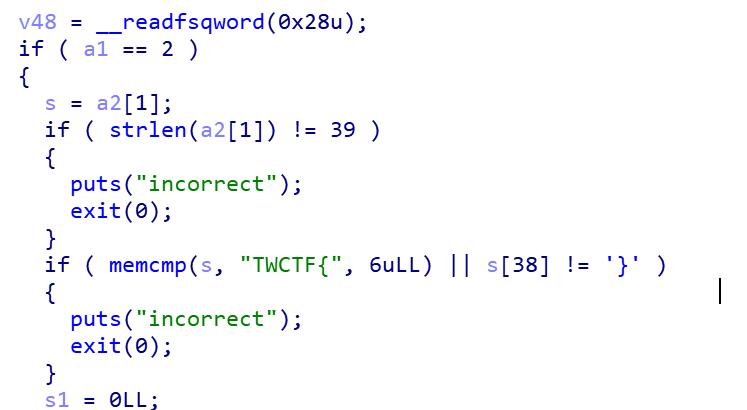

一开始很明显，flag长度为39且前6位为TWCTF{最后一位是 }   s就相当于flag

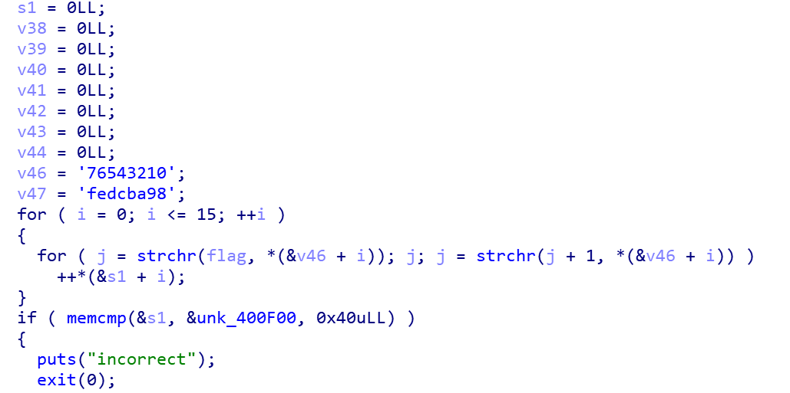

接着是一段check，稍微把变量类型修改下看起来舒服些

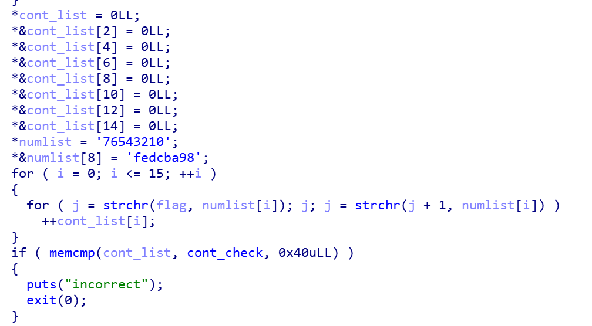

能看出来这是对flag里[0-9][a-f]进行计次，并且要符合cont_check里的值

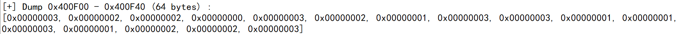

接着是两端相似的验证，直接扔上来修改后的

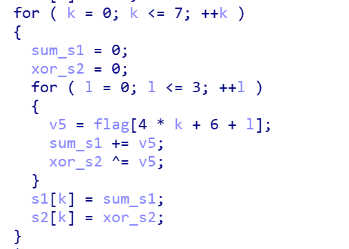
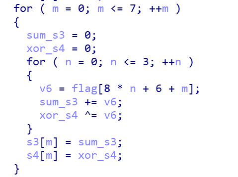

接着就是对[s1,s2,s3,s4]进行check

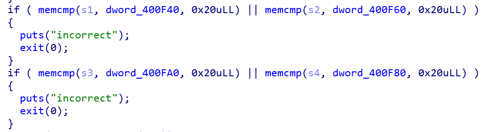

然后我们老样子把数据从地址中提取出来

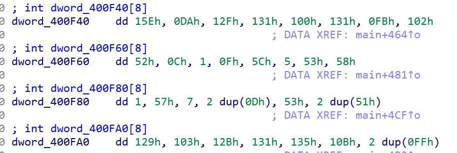

然后把上面的整理一下就变成

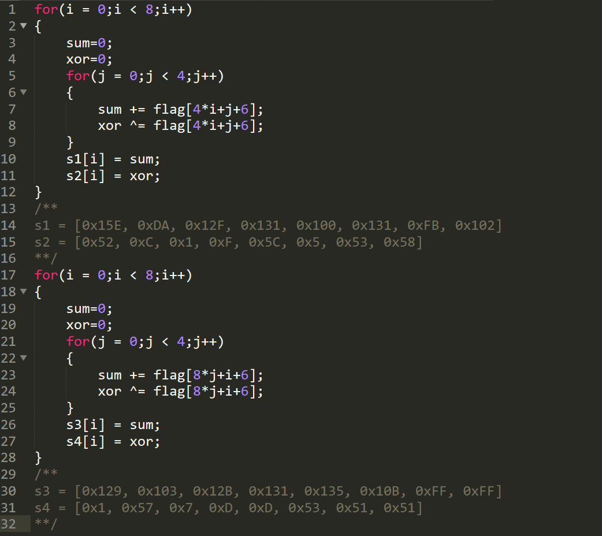

然后就直接用z3去求这个约束

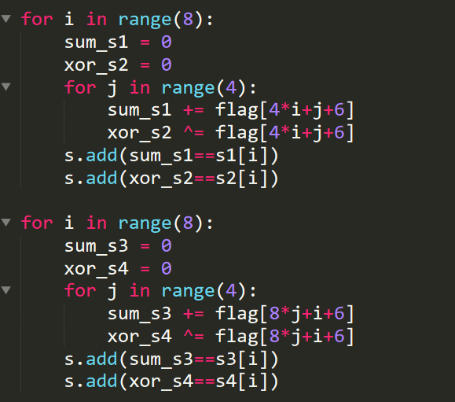

然后下面也是个简单的判断然后对比，再把这个条件加到约束条件中

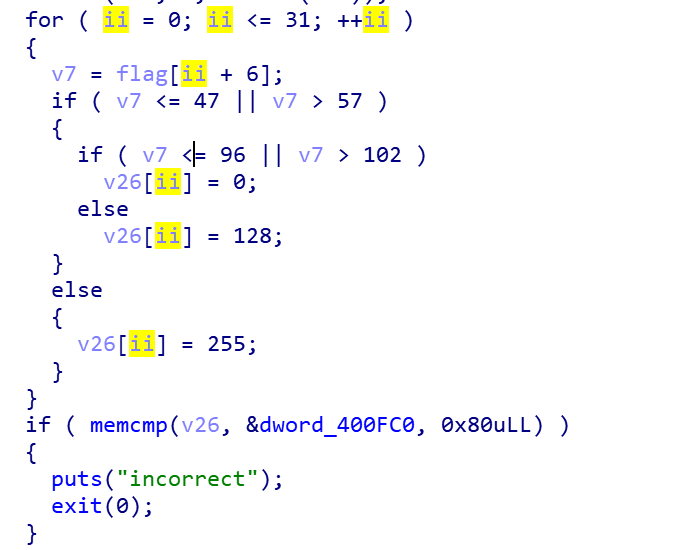

然后是检验ascii码之和是否为1160和flag的某些位是否为某个值

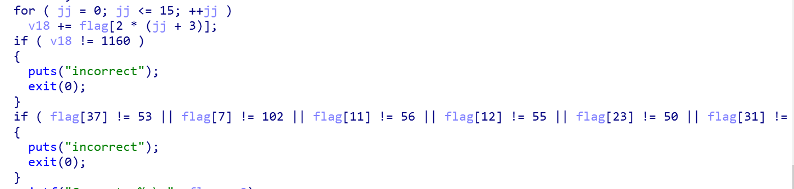

这两个整理下加入z3脚本里就是

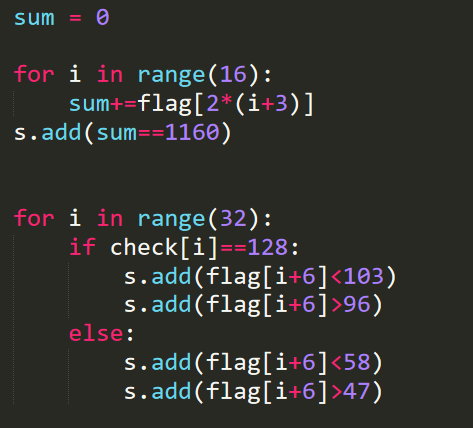

接着就是最开始的统计字符出现个数的约束
这个巨蛋疼，当时不知道z3要用If函数（大写I小写f）用if弄了半天unsat

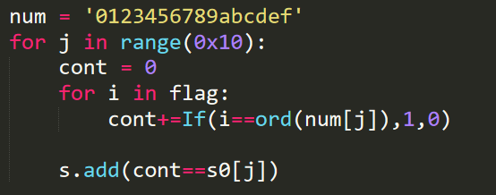

最终代码

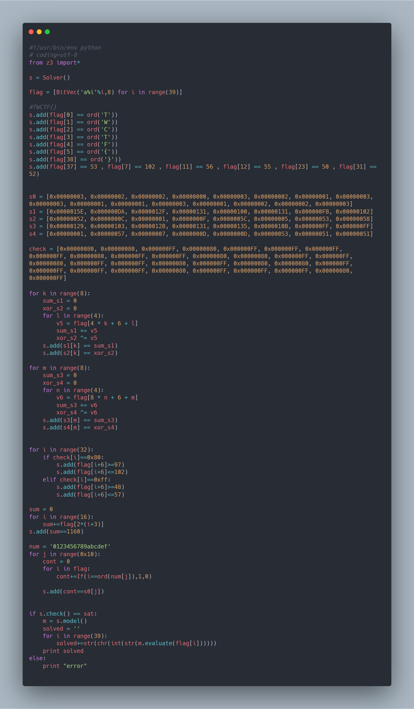
TWCTF{df2b4877e71bd91c02f8ef6004b584a5}
